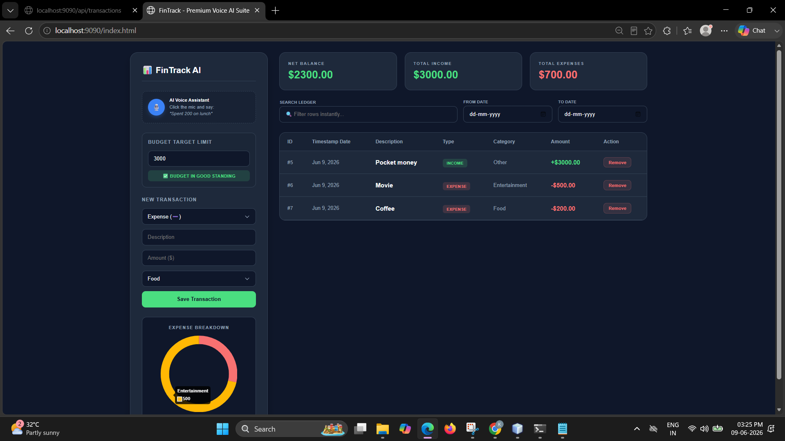

#  FinTrack AI - Premium Financial Suite

A full-stack, responsive personal finance ecosystem. The system features an automated budget tracking matrix, data visualization engines, chronological timeline filtering, and an integrated native speech-processing engine.

---

## Live Interface Preview

###  Smart Analytics Dashboard & Budget Metrics
Here is the core analytical layout tracking transactions, categorical breakdowns, and active budget statuses:

---

##  Tech Stack & Architecture

- **Backend Architecture:** Java 17, Spring Boot, RESTful Web APIs, H2 Persistent Storage Data Matrix.
- **Frontend Layer:** Semantic HTML5, CSS3 Custom Properties (Fluid CSS Variables), Asynchronous JavaScript Engine (Fetch API Runtime).
- **Visualization Suite:** Chart.js Module Layer (Reactive Canvas Interactivity).
- **AI Engine integration:** Web Speech API Interface (Native Browser Microphone Parsing Framework).

##  Core Engineered Features

1. **Voice-Activated Ledger Entry:** Custom natural-language parsing rules to process spoken expressions like *"Spent 200 on lunch"* directly into stored structural properties.
2. **Dynamic Budget Alert Systems:** Real-time computation thresholds monitoring global expense categories, changing states automatically (`✅ Safe` -> `⚠️ Warning` -> `❌ Breached`).
3. **Dual-Date Boundary Filtration:** Zero-latency client-side table range filtering across database timestamps.
